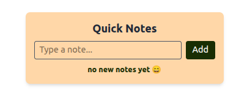

 

[![Contributors][contributors-shield]][contributors-url]
[![Forks][forks-shield]][forks-url]
[![Stargazers][stars-shield]][stars-url]
[![Issues][issues-shield]][issues-url]
[![LinkedIn][linkedin-shield]][linkedin-url]

 
<h3 align="center"> 🗒️ Quick Notes 🗒️ </h3>

  

    A simple note taking application for your browser!
  

  

  
  

[contributors-shield]: https://img.shields.io/github/contributors/SharleneNdinda/quick-notes?style=for-the-badge
[contributors-url]: https://github.com/SharleneNdinda/quick-notes/contributors
[forks-shield]: https://img.shields.io/github/forks/SharleneNdinda/quick-notes?style=for-the-badge
[forks-url]: https://github.com/SharleneNdinda/quick-notes/forks
[stars-shield]: https://img.shields.io/github/stars/SharleneNdinda/quick-notes?style=for-the-badge
[stars-url]: https://github.com/SharleneNdinda/quick-notes/stargazers
[issues-shield]: https://img.shields.io/github/issues/SharleneNdinda/quick-notes?style=for-the-badge
[issues-url]: https://github.com/SharleneNdinda/quick-notes/issues
[linkedin-shield]: https://img.shields.io/badge/-LinkedIn-black.svg?style=for-the-badge&logo=linkedin&colorB=555
[linkedin-url]: in/sharlene-mutuku-86571518b
[product-screenshot]: images/architecture.png
[x-ray-trace]: images/trace.png
[Django]: https://img.shields.io/badge/django-35495E?style=for-the-badge&logo=django&logoColor=87CEEB
[Bootstrap.com]: https://img.shields.io/badge/Bootstrap-563D7C?style=for-the-badge&logo=bootstrap&logoColor=white
[Bootstrap-url]: https://getbootstrap.com
[JQuery.com]: https://img.shields.io/badge/jQuery-0769AD?style=for-the-badge&logo=jquery&logoColor=white
[JQuery-url]: https://jquery.com
